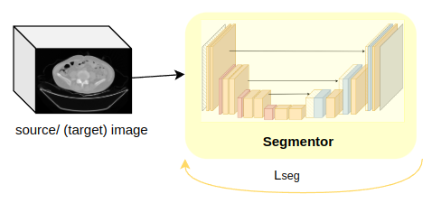
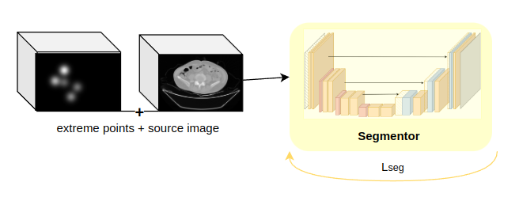
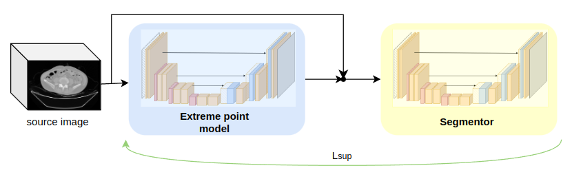
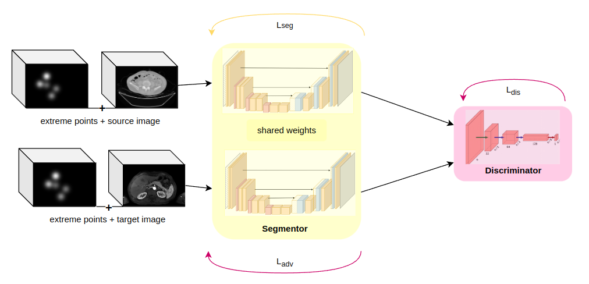
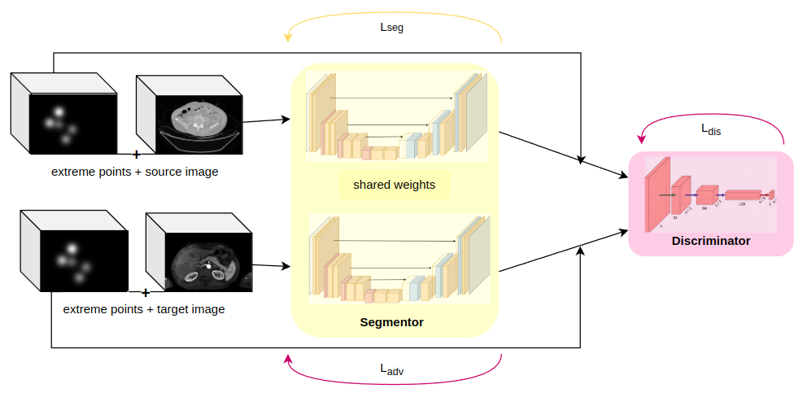

# Towards Interactive Domain Adaptation for CT and MRI

This repository contains the implementation of different network architectures for domain adaptation and domain generalization combined with interactive segmentation.

This code was exracted from MONAI, reworked by M.Sc. Zdravko Marinov, Karlsuhe Institute of Techonology (zdravko.marinov@kit.edu) and M.Sc. Matthias Hadlich, Karlsuhe Institute of Techonology (matthiashadlich@posteo.de) to make it's way into my master thesis, which is this repository. 2024, M. Sc. Franziska Seiz, Karlsuhe Institute of Technology (franzi.seiz96@gmail.com)

**Important**: This code is only tested on the AMOS 2022 dataset. 2D images are not suppported.

## Full deep learning workflow

### Training (image and label)

Use the different `train_.py` files for that. The ending source specifies that the network is only trained on the source data. Use the `--resume_from` flag to resume training from an aborted previous experiment. Available options are listed in `src/swfastedit/utils/argparser.py` Example usage:

`python3 train_dextr_source.py -a -i /dataset/AMOS --dataset AMOS -o /projects/results  -c /projects/cache -ta -e 150 --organ 10 --source_dataset image_ct --target_dataset image_mri`

### Evaluation/Testing

Use the `train_.py` files for that and only add the `--eval_only` flag. The network will only run the evaluator which finishes after one epoch. Evaluation will use the images and the label and thus print a metric at the end.
Use the `--resume_from` flag to load previous weights.
Use `--save_pred` to save the resulting predictions.

## Different network options
### Dynamic U-Net
option to train on CT and MRI images (`train_dynunet.py`) or only on the source dataset (`train_dynunet_source.py`)  

### DEXTR
https://arxiv.org/abs/1711.09081  
option to train on CT and MRI images (`train_dextr.py`) or only on the source dataset (`train_dextr_source.py`)  

### Dual dynamic U-Net
http://dx.doi.org/10.1007/978-3-030-59710-8_45  

### PADA
option to train with (`-ep`) and without extreme points  
https://arxiv.org/abs/1802.10349  

### UGDA
http://dx.doi.org/10.1007/978-3-030-59710-8_45  
To run ugda on a pre-trained DEXTR network use `--resume_from` to load the weights and `--resume_override_scheduler`

## Tensorboard
Different parameters are tracked during the training and can be found in the tensorboard folder. To display them run `tensorboard --logdir .` in the conda environment with the path to the tensorboard file.

## Dataset
AMOS 2022: divide the dataset into an CT and MRI folders with each containing: imagesTr, labelsTr, imagesTs, labelsTs.

## GPU usage
The code ran on 24GB, 46GB and 49GB GPUs.

